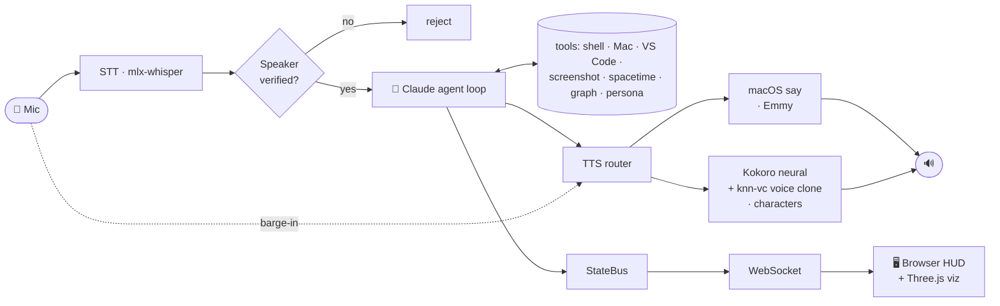

# Noether 🎙️⚛️

[](https://github.com/sammiezx/Noether/actions/workflows/ci.yml)
[](LICENSE)
-111.svg)

A **local, voice-controlled AI assistant** for macOS — and an **interactive physics
visualization platform**. You talk; **Emmy** (named after
[Emmy Noether](https://en.wikipedia.org/wiki/Emmy_Noether)) listens, reasons with Claude,
and talks back — driving your Mac, your editor, and a suite of 3D physics visualizations.
She can also *become* other people: a believable, in-character **Albert Einstein** or a
gravel-voiced **Batman**, using on-device voice cloning.

Everything except the Claude calls runs **on-device on Apple Silicon** — speech-to-text,
text-to-speech, neural voice cloning, and speaker verification are all local.

> **🔭 The visualizations are live (no install needed):** **https://sammiezx.github.io/Noether/**
> — interactive spherical harmonics, superposition, spacetime/black holes, and hydrogen orbitals.

<!-- DEMO: drop a screen-recording GIF of a voice conversation here, e.g.  -->

---

## What it does

- **Agentic voice loop** — Claude runs a real multi-step tool-use loop: it can chain shell
  commands, control the Mac and VS Code, read files, take screenshots, and open
  visualizations — narrating progress between steps.
- **On-device & private** — local Whisper STT (`mlx-whisper`), neural TTS, and speaker
  verification. Your audio never leaves the machine.
- **Speaker-locked** — enrolls *your* voice on first run and only responds to you.
- **Personas with cloned voices** — Einstein, Shiva, Krishna, Durga, Batman, Spider-Man,
  Iron Man. Each fully in character (first-person, never breaks), with a voice to match —
  including real voice cloning (e.g. Einstein from an archival recording).
- **Barge-in** — talk over Emmy mid-sentence and she stops and listens.
- **Physics visualizations** — voice-controlled 3D scenes (black hole, light cones,
  gravitational waves, N-body, curvature) and an equation grapher, all rendered in the browser.

---

## Architecture



A per-turn cycle: **listen → verify speaker → transcribe → Claude tool-use loop → speak**
(with barge-in), while a FastAPI + WebSocket server streams state to a browser UI.

### The agent loop ([brain.py](brain.py))
`Brain.respond()` is multi-turn under the hood: each call may invoke tools several times
before producing the final spoken reply. The system prompt is built live from a **base
identity + the active persona's style**; immersive personas (e.g. Einstein) fully take over
in the first person and won't break character. Intermediate narration is streamed to TTS so
you hear *"let me check…"* before the tool runs.

### The voice pipeline ([tts.py](tts.py), [neural_tts_server.py](neural_tts_server.py))
TTS is a **router**. Emmy uses macOS `say` (instant). Character personas route to a neural
engine: **Kokoro** synthesizes clear speech, then **knn-vc voice conversion** repaints it
into a target voice cloned from a reference clip — so Einstein actually sounds like Einstein.
The neural stack runs in a separate Python 3.12 helper process (it won't build on 3.14),
kept warm so the model loads once.

### Safety
The agent runs shell commands autonomously, so [`run_shell`](tools.py) refuses a denylist of
catastrophic patterns (disk wipes, `rm -rf /`, fork bombs, power-off). It's a guardrail, not
a sandbox — **run Emmy only on a machine you trust.**

---

## Components

| File | Role |
|------|------|
| `main.py` | Entry point — boots the loop thread + server, opens the UI in Safari |
| `loop.py` | The conversation loop & state machine (stoppable) |
| `brain.py` | Claude client + agentic tool-use loop + persona-aware system prompt |
| `tools.py` | The tools Claude can call (+ the run_shell guardrail) |
| `audio.py` | Persistent mic stream, VAD, barge-in detection |
| `stt.py` | Speech-to-text (mlx-whisper) |
| `tts.py` | TTS router: macOS `say` (Emmy) or neural Kokoro+VC (characters) |
| `neural_tts_server.py` | Persistent neural renderer (Kokoro + knn-vc) in the 3.12 env |
| `persona.py` | Persona definitions: style, voice, relationship, immersion |
| `voice_id.py` | Speaker enrollment + verification (Resemblyzer) |
| `server.py` | FastAPI: static UI + WebSocket + the `/equations` sub-app |
| `state_bus.py`, `controls.py` | Thread-safe pub/sub + pause/stop |
| `static/`, `docs/` | Browser UI + the deployed visualization platform |
| `equation_viz/` | Equation → interactive Plotly figure (Claude-parsed) |

---

## Setup

Requires **macOS on Apple Silicon**, **Homebrew**, **Python 3.11+** (app) and **Python 3.12**
(neural voices: `brew install python@3.12`). macOS-only by design — it leans on `say`,
`mlx`, `osascript`, and `screencapture`.

```bash
./start.sh        # one command: sets up both envs + models if needed, then runs
```

Add your `ANTHROPIC_API_KEY` to `.env` when prompted. Grant the terminal **Microphone** and
**Accessibility** permissions (System Settings → Privacy & Security). Set
`NOETHER_PERSONA=einstein` to boot straight into a character. Prefer to set up by hand? See
the steps in [`start.sh`](start.sh) and [`setup_neural_tts.sh`](setup_neural_tts.sh).

---

## Visualizations

The `docs/` site is a standalone, deployable physics platform (GitHub Pages) — no AI or mic
required to run it. Live at **https://sammiezx.github.io/Noether/**:

- **Spherical Harmonics** — Yₗᵐ as lobes, sphere maps, and animated complex phase
- **Superposition** — build orbitals/hybrids from interference; time-evolution
- **Spacetime & Black Holes** — 5 scenes you can orbit
- **Quantum States** — real 3D hydrogen orbital probability clouds

---

## Tests

```bash
python -m pytest tests/
```

Import-light core tests (tool registry, persona system, TTS fallback, the run_shell
guardrail, prompt construction) run in CI on every push. The audio/ML modules need a Mac +
on-device models, so they're verified by `compileall` in CI and manually otherwise.

---

## License

[MIT](LICENSE) © Sameer Pant
